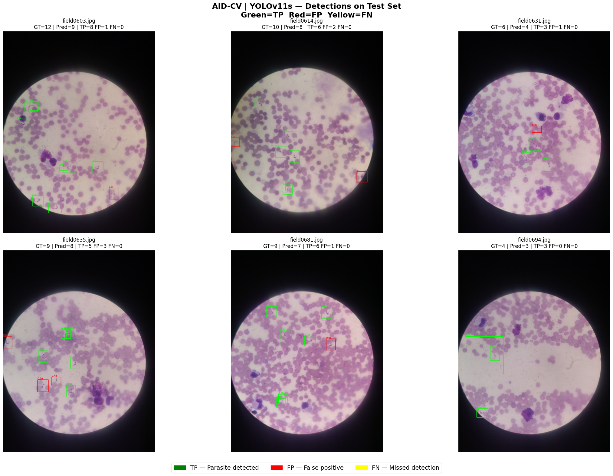

# Trypanosoma Cruzi Detection in Microscopic Blood Samples

This repository contains the complete research and development pipeline for detecting *Trypanosoma cruzi* using deep learning techniques. The project focuses on automating the identification of this parasite in microscopic images to assist in medical diagnosis.

## 📌 Project Overview
The core of this research is documented in the [Full Pipeline - Models - AID-CV.ipynb](./Full-Pipeline.ipynb) notebook, which includes data preprocessing, model selection, training, and comprehensive evaluation.

## 🔬 Methodology: CRISP-ML(Q)
The project follows the **CRISP-ML(Q)** (Cross-Industry Standard Process for Machine Learning with Quality Assurance) framework to ensure a rigorous and reproducible scientific workflow.

_METHODOLOGY_-_Diagram.jpg)
*Note: The diagram illustrates the six phases: Business & Data Understanding, Data Engineering, ML Model Engineering, Quality Assurance, Deployment, and Monitoring.*

## 🚀 Model Selection: YOLO11 Small
After benchmarking several architectures, **YOLO11 Small (yolo11s)** was selected due to its optimal balance between inference speed and detection accuracy, which is critical for edge-case medical applications.

### Performance Testing & Validation
The model was evaluated on a dedicated test set. The following results demonstrate its ability to distinguish parasites from cellular debris and background noise.

#### Detection Performance

#### Key Metrics Observed:
*   **True Positives (TP):** High accuracy in identifying *T. cruzi* parasites.
*   **False Positives (FP):** Controlled rate, minimizing incorrect diagnoses of non-parasitic artifacts.
*   **False Negatives (FN):** Low omission rate, ensuring the majority of present parasites are captured.

## 📂 Repository Structure
*   `Full Pipeline - Models - AID-CV.ipynb`: Main research document containing all documentation and code.
*   `CRISP-ML(Q) METHODOLOGY - Diagram.jpg`: Methodological diagrams
*   `YOLOv11s_detecciones.png`: Performance visualizations.
---
*This research serves as a tool for medical computer vision applications.*

## 📄 License & Attribution
This project is open-source under the **MIT License**.

### Giving Credit
If you use this work, code, or methodology in your own research or projects, please provide attribution by citing this repository:

> **Richard Sucuy, Micaela Sucuy, Karla Aguialar and Eduardo Tusa**, *Trypanosoma Cruzi Detection in Microscopic Blood Samples*, (2026), GitHub repository: https://github.com/RichardSucuy/Full-Pipeline-Models-AID-CV

You can also use the [LICENSE](./LICENSE) file for legal details.
